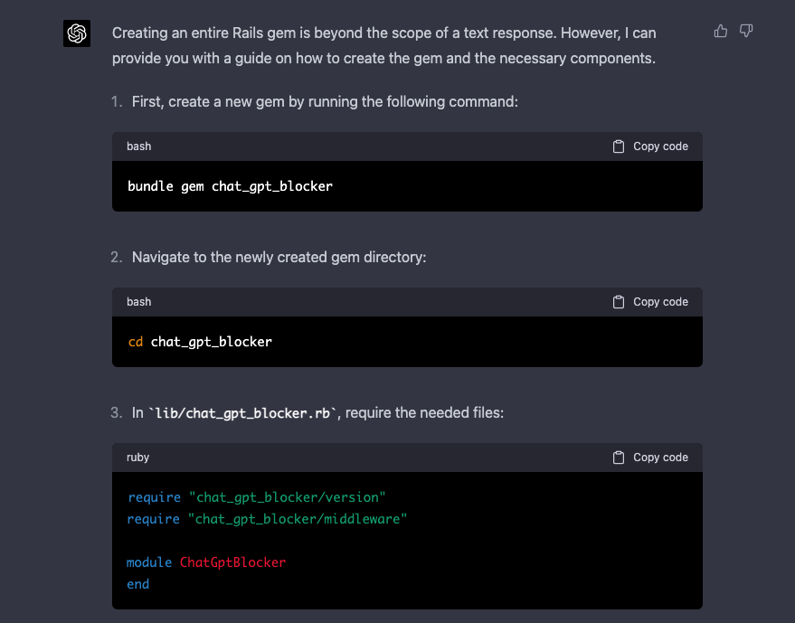

# ChatGPT Blocker

Context: https://platform.openai.com/docs/plugins/bot. Add this gem if you want to block your website to the ChatGPT.

Funny part: gem was generated with ChatGPT too :)



The ChatGPT Blocker gem is a simple middleware for Rails applications that blocks requests with a specified user agent pattern. By default, it blocks requests with the "ChatGPT-User" user agent.

## Installation

Add this line to your application's Gemfile:

```ruby
gem 'chat_gpt_blocker'
```

And then execute:

`$ bundle install`

Or install it yourself as:

bash

`$ gem install chat_gpt_blocker`

## Usage

Once you've added the gem to your Gemfile and ran bundle install, the middleware will automatically be included in your Rails application. No additional configuration is needed.

By default, the gem blocks requests with a user agent that matches the "ChatGPT-User" pattern.

## License

The gem is available as open source under the terms of the [MIT License](https://opensource.org/licenses/MIT).

[](https://www.railsjazz.com/?utm_source=github&utm_medium=bottom&utm_campaign=chat_gpt_blocker)
